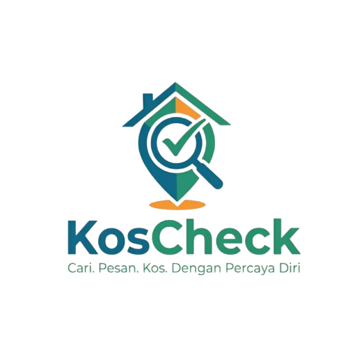

# KosCheck - Platform Pencarian Kos Mahasiswa Indonesia

<p align="center">
  
</p>

<p align="center">
  <strong>Temukan Kos Nyaman Dekat Kampus dengan Aman</strong>
</p>

<p align="center">
  <a href="https://github.com/V21-N/CheckKos"></a>
  <a href="https://laravel.com"></a>
  <a href="https://php.net"></a>
  <a href="https://tailwindcss.com"></a>
</p>

---

## Overview

**KosCheck** adalah platform digital terpercaya untuk pencarian kos (boarding house) bagi mahasiswa Indonesia. Platform ini menghubungkan mahasiswa dengan pemilik kos melalui sistem verifikasi listing, review autentik dari mahasiswa, dan komunikasi langsung via WhatsApp.

### Problem yang Diselesaikan

- Kesulitan mahasiswa menemukan kos yang aman dan terpercaya di dekat kampus
- Kurangnya informasi transparan tentang kondisi kos sebenarnya
- Proses booking yang tidak terorganisir
- Potensi penipuan dalam transaksi kos

---

## Key Features

### Untuk Mahasiswa
- **Pencarian Kos** - Filter berdasarkan lokasi, jenis kelamin (putra/putri/campur), range harga, dan fasilitas
- **Review & Rating** - Baca review dari mahasiswa lain dengan rating kebersihan, keamanan, dan fasilitas
- **Booking Online** - Ajukan booking langsung melalui platform
- **WhatsApp Direct** - Hubungi pemilik kos langsung tanpa menyimpan nomor
- **Rekomendasi Kos Terdekat** - Saran kos berdasarkan lokasi saat ini

### Untuk Pemilik Kos (Owner)
- **Dashboard Properti** - Kelola semua kos dalam satu dashboard
- **Lead Tracking** - Lacak setiap inquiry dari calon penyewa
- **Manajemen Booking** - Terima dan proses permintaan booking
- **Notifikasi Real-time** - Dapatkan notifikasi untuk booking baru dan lead
- **Upload Foto** - Galeri foto dengan urutan kustom

### Untuk Admin
- **Verifikasi Listing** - Approve/reject kos baru sebelum dipublikasikan
- **Moderasi Review** - Kelola review yang ter-flag atau mencurigakan
- **Manajemen User** - Kelola role dan status pengguna
- **Report System** - Sistem pelaporan untuk konten yang tidak pantas
- **Analytics Dashboard** - Statistik platform secara menyeluruh

---

## Tech Stack & Prerequisites

### Server Requirements

| Component | Minimum Version | Description |
|-----------|----------------|-------------|
| **PHP** | 8.2+ | Server-side language |
| **Composer** | 2.x | PHP package manager |
| **Node.js** | 18.x+ | JavaScript runtime |
| **npm** | 9.x+ | Node package manager |

### Database Options

| Database | Driver Config | Notes |
|----------|---------------|-------|
| **MySQL** | `DB_CONNECTION=mysql` | Recommended for production |
| **SQLite** | `DB_CONNECTION=sqlite` | For development/testing |
| **Redis** | `REDIS_CLIENT=predis` | Optional, for caching and queues |

### Technology Stack

| Layer | Technology | Version |
|-------|------------|---------|
| **Backend Framework** | Laravel | 13.x |
| **Frontend Framework** | Blade + Alpine.js | Latest |
| **CSS Framework** | Tailwind CSS | v4.3.0 |
| **Build Tool** | Vite | v7.x |
| **API Authentication** | Laravel Sanctum | v4.x |
| **Web Authentication** | Laravel Breeze | v2.x |
| **Queue** | Laravel Queue (Redis/Predis) | - |
| **Cache** | Laravel Cache | - |

### Development Tools (Optional)

| Tool | Purpose |
|------|---------|
| **Laravel Herd / Valet** | Local development server |
| **Laragon** | Windows local development environment |
| **Xdebug** | PHP debugging |
| **PHPStorm** | IDE with Laravel support |

---

## Getting Started

### 1. Clone the Repository

```bash
git clone https://github.com/V21-N/CheckKos.git
cd CheckKos
```

### 2. Install PHP Dependencies

```bash
composer install
```

### 3. Install Node.js Dependencies

```bash
npm install
```

### 4. Environment Setup

Copy the example environment file and configure your database:

```bash
cp .env.example .env
```

Edit `.env` file with your configuration:

```env
APP_NAME=KosCheck
APP_ENV=local
APP_KEY=
APP_DEBUG=true
APP_URL=http://localhost:8000

# Database Configuration (MySQL)
DB_CONNECTION=mysql
DB_HOST=127.0.0.1
DB_PORT=3306
DB_DATABASE=checkkos
DB_USERNAME=root
DB_PASSWORD=

# Or use SQLite for development
# DB_CONNECTION=sqlite
# DB_DATABASE=/absolute/path/to/database.sqlite

# Cache & Session
SESSION_DRIVER=database
CACHE_STORE=database
QUEUE_CONNECTION=sync

# Redis (Optional - for production)
# REDIS_CLIENT=predis
# REDIS_HOST=127.0.0.1
# REDIS_PASSWORD=null
# REDIS_PORT=6379
```

### 5. Generate Application Key

```bash
php artisan key:generate
```

### 6. Run Database Migrations

```bash
php artisan migrate
```

### 7. (Optional) Seed Database with Sample Data

```bash
php artisan db:seed
```

### 8. Create Storage Link

```bash
php artisan storage:link
```

### 9. Start Development Server

You can start the development server with either:

**Option A: Using Artisan (Simple)**
```bash
php artisan serve
```

**Option B: Using npm run dev + Artisan (with hot reload)**
```bash
# Terminal 1 - Start Vite dev server
npm run dev

# Terminal 2 - Start Laravel server
php artisan serve
```

**Option C: Using Concurrently (All in one terminal)**
```bash
npm run dev
```

The application will be available at `http://localhost:8000`.

### Vercel Deployment (Optional)

The project includes Vercel configuration for deployment. See `.vercel/` directory for configuration files.

---

## Project Structure

```
CheckKos/
├── app/
│   ├── Http/
│   │   ├── Controllers/
│   │   │   ├── Admin/           # Admin panel controllers
│   │   │   ├── Api/V1/           # REST API v1 controllers
│   │   │   ├── Auth/             # Laravel Breeze authentication
│   │   │   ├── Mahasiwa/         # Student-specific controllers
│   │   │   ├── Owner/            # Owner-specific controllers
│   │   │   └── Web/              # Public web controllers
│   │   ├── Middleware/           # Role-based access control
│   │   ├── Requests/             # Form request validation classes
│   │   └── Resources/            # API resource transformers
│   ├── Models/                   # Eloquent models (User, Kos, Booking, etc.)
│   ├── Services/                 # Business logic services
│   ├── Jobs/                     # Queue jobs for async processing
│   ├── Notifications/            # Notification classes
│   ├── Policies/                 # Authorization policies
│   └── Events/                   # Event classes
├── config/                       # Laravel configuration files
├── database/
│   ├── migrations/               # Database schema migrations
│   ├── seeders/                 # Database seeders
│   └── factories/               # Model factories for testing
├── public/
│   ├── images/                   # Static images (logos, placeholders)
│   └── storage/                  # Symlinked storage for user uploads
├── resources/
│   ├── css/                      # Tailwind CSS and custom styles
│   ├── js/                       # Alpine.js and custom JavaScript
│   └── views/                   # Blade template views
│       ├── layouts/             # Layout templates (admin, owner, mahasiswa, landing)
│       ├── auth/                # Authentication views
│       └── components/          # Reusable Blade components
├── routes/
│   ├── web.php                   # Web routes
│   └── api.php                   # API routes (v1)
├── storage/
│   ├── app/                      # Application storage
│   ├── framework/               # Framework cache, sessions, views
│   └── logs/                    # Application logs
├── tests/                       # PHPUnit tests
├── .env.example                 # Example environment configuration
├── composer.json                # PHP dependencies
├── package.json                 # Node.js dependencies
├── vite.config.js              # Vite build configuration
├── tailwind.config.js          # Tailwind CSS configuration
└── prd_new.prd                  # Product Requirement Document
```

---

## Database Schema Overview

### Core Entities

| Table | Description |
|-------|-------------|
| `users` | User accounts (mahasiswa, owner, admin) |
| `kos` | Kos/boarding house listings |
| `photos` | Kos photo gallery |
| `facilities` | Available facilities (AC, WiFi, etc.) |
| `kos_facilities` | Many-to-many relationship |
| `reviews` | User reviews and ratings |
| `leads` | Lead tracking for inquiries |
| `bookings` | Booking requests |
| `ads` | Advertisement inventory |
| `reports` | User-submitted reports |
| `report_types` | Types of reports |
| `app_notifications` | In-app notifications |

### User Roles

| Role | Description |
|------|-------------|
| `mahasiswa` | Student users searching for kos |
| `owner` | Property owners managing listings |
| `admin` | Platform moderators |

---

## API Routes (v1)

### Public Endpoints

```
GET  /api/v1/public/kos              # List all active kos
GET  /api/v1/public/kos/search      # Search kos with filters
GET  /api/v1/public/kos/featured    # Get featured kos
GET  /api/v1/public/kos/{slug}      # Get kos detail
GET  /api/v1/public/kos/{slug}/nearby # Get nearby kos
GET  /api/v1/public/kos/{slug}/reviews # Get kos reviews
```

### Authentication Endpoints

```
POST /api/v1/auth/login              # Login
POST /api/v1/auth/register           # Register
POST /api/v1/auth/logout             # Logout
GET  /api/v1/auth/me                # Get current user
```

### Protected Endpoints (Require Authentication)

```
# Student
POST /api/v1/kos/{slug}/reviews      # Submit review
GET  /api/v1/reviews/me              # Get my reviews
POST /api/v1/student/booking         # Create booking
GET  /api/v1/student/bookings        # Get my bookings

# Owner
GET  /api/v1/owner/leads            # Get leads
PUT  /api/v1/owner/bookings/{id}/status # Update booking status

# Admin
GET  /api/v1/admin/leads            # Platform-wide leads
GET  /api/v1/admin/bookings         # Platform-wide bookings
```

---

## Available npm Scripts

| Script | Description |
|--------|-------------|
| `npm run dev` | Start Vite development server with hot reload |
| `npm run build` | Build assets for production |
| `npm run preview` | Preview production build locally |

---

## Available Artisan Commands

| Command | Description |
|---------|-------------|
| `php artisan serve` | Start development server |
| `php artisan migrate` | Run database migrations |
| `php artisan db:seed` | Seed database with sample data |
| `php artisan db:seed --class=KosSeeder` | Seed specific seeder |
| `php artisan storage:link` | Create storage symlink |
| `php artisan queue:work` | Start queue worker |
| `php artisan optimize:clear` | Clear all caches |

---

## Contributing

Contributions are welcome! Please feel free to submit a Pull Request.

1. Fork the repository
2. Create your feature branch (`git checkout -b feature/AmazingFeature`)
3. Commit your changes (`git commit -m 'Add some AmazingFeature'`)
4. Push to the branch (`git push origin feature/AmazingFeature`)
5. Open a Pull Request

---

## License

This project is open-sourced software licensed under the [MIT license](LICENSE).

---

## Contact & Maintainer

| Item | Information |
|------|-------------|
| **Maintainer** | Muhammad Alvin Nurrahman |
| **GitHub** | [https://github.com/V21-N](https://github.com/V21-N) |
| **Email** | vinnr21@gmail.com |
| **WhatsApp** | 081376448988 (For urgent inquiries) |

---

<p align="center">
  <strong>Built with ❤️ for Indonesian students</strong>
</p>

<p align="center">
  &copy; 2026 KosCheck Indonesia. All rights reserved.
</p>